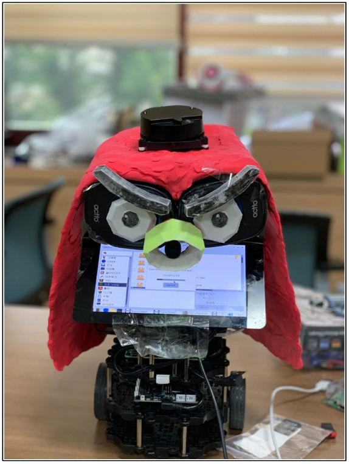

### **[프로젝트 과정 기록](https://blog.naver.com/PostList.nhn?blogId=confettimimy&from=postList&categoryNo=7)**  👈🏻👈🏻👈🏻😃

#

# 라이다 자율주행 및 음성 대화 안내 사서 로봇

찾고자 하는 책의 제목을 말하면 책의 이름을 인식해 음성 안내와 함께 해당 책이 있는 위치까지 자율주행해서 데려다 주는 도서관 사서 로봇입니다.

- 라이다, SLAM, Navigation을 이용한 자율주행 기술
- STT, TTS 기술을 이용한 음성인식 및 음성안내 서비스
- 디스플레이에 박태준 도서관 지도 기능 탑재, 실시간 현위치 서비스   

#

## 제목

