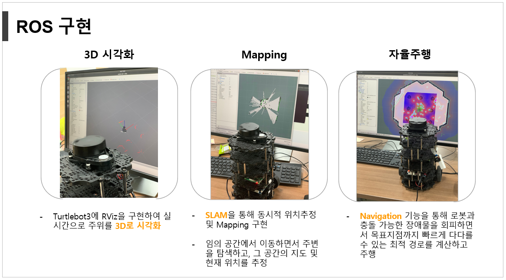

# 라이다 자율주행 및 음성 대화 안내 사서 로봇

찾고자 하는 책의 제목을 말하면 책의 이름을 스스로 인식해 음성 안내와 함께 해당 책이 있는 위치까지 자율주행해서 데려다 주는 도서관 사서 로봇입니다.

### **[프로젝트 과정 기록](https://blog.naver.com/PostList.nhn?blogId=confettimimy&from=postList&categoryNo=7)**  👈🏻😃
(자세한 내용은 발표자료, 최종 보고서 참고)

#

### 완성된 사서 로봇의 모습 

하드웨어: 라이다, 터틀봇 버거3, 디스플레이, 마이크, 스피커 장착

개발한 소프트웨어: ts.exe

  

#

### 시연영상 Demo

#

### * 라이다, SLAM, Navigation을 이용한 자율주행 기술

    

### * STT, TTS 기술을 이용한 음성인식 및 음성안내 서비스

[사진]    

### * 디스플레이에 박태준 도서관 지도 기능 탑재, 실시간 현위치 서비스  

[사진]

---

## 작동방식

1. 찾고자 하는 책의 제목 음성 입력 ▶️ 음성인식 ▶️ 서버 db를 거쳐 해당 책의 위치 정보를 클라이언트에 음성으로 송출 (= 음성안내)
2. 해당 책의 위치 정보를 목적지로 지정 ▶️ SLAM을 이용해 스스로 주변 물체를 탐지하며 스스로 자율주행
3. 자율주행 도중 디스플레이의 지도 show 기능을 통해 실시간 위치 파악
4. 찾고자 하는 책의 위치에 도착 ▶️ 도착했다는 음성 안내와 함께 종료
